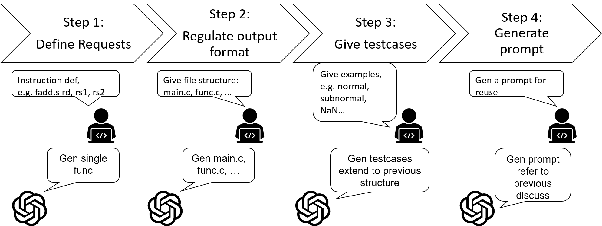

# Case study: RV32IMZf integration

> ### 📌 Summary
>
> **🧠 A summary of how I used ChatGPT to automate test generation during RV32IM+Zfinx integration — turning verification pain points into a reusable LLM workflow.**

This project started from a real engineering challenge during the integration of the Zfinx extension into an RV32IM processor.
Which can be refer to: [RV32Zfinx-FPU-Integration-Note](https://github.com/ytcheng-lab/RV32Zfinx-FPU-Integration-Note)

To improve the quality and efficiency of ISA-level verification, I explored the use of Large Language Models (LLMs), like ChatGPT, to generate test cases, analyze coverage gaps, and assist with debugging. This experience led to the creation of a prompt design guide and a semi-automated verification flow.

## My Contributions

- Verified the Zfinx extension in a custom RV32IM processor.
- Developed prompt strategies using ChatGPT to generate test cases and reference outputs.
- Improved the coverage and clarity of riscv-tests by reformatting test structures and automating parts of the workflow.
- Presented findings in an internal technical report and cross-team meeting.

These explorations helped me validate the idea that LLMs can improve efficiency and reduce verification effort. This inspired the closed-loop prototype presented in the main report of this repository.

## My Prompt Design Process with LLM

To explore LLM-assisted functional verification, I developed a 4-step prompt design process. These slides demonstrate how I guided the LLM to generate test cases and code structure for floating-point instructions on RV32IM+Zfinx.

### Step 1: Define Requests

Clearly explain the design verification context and target instruction.  
Provide an example template to help LLM infer the task structure.

### Step 2: Regulate Output Format

Standardize the file structure for generated outputs.  
Ensure clarity between main function, test logic, and headers.

### Step 3: Give Testcases

Provide LLM with expected input–output pairs.  

### Step 4: Generate Prompt

Use all prior elements to create a reusable prompt format.  
The prompt should be concise, structured, and modular for multiple instructions.
